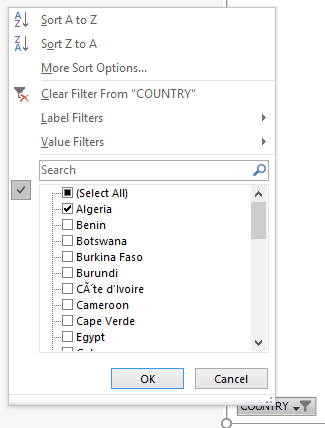

<style type="text/css">

body, td {
   font-size: 18px;
}
h1 {
  font-size: 32px;
  font-weight: bold;
}
h2 {
  font-size: 28px;
  font-weight: bold;
}
h3 {
  font-size: 24px;
  font-weight: bold;
}
h4 {
  font-size: 20px;
  font-weight: bold;
}
code.r{
  font-size: 16px;
}
pre {
  font-size: 16px
}
</style>

## 1.0 Introduction

Much has been written about China's activities in Africa [[**1**](https://www.amazon.com/Chinas-Second-Continent-Migrants-Building-ebook/dp/B00GVZVB9W), [**2**](https://www.amazon.com/Next-Factory-World-Investment-Reshaping-ebook/dp/B01MUGYCME), [**3**](https://www.amazon.com/Dragons-Gift-Story-China-Africa-ebook/dp/B005PUWRM4), [**4**](https://www.amazon.com/Will-Africa-China-Deborah-Brautigam-ebook/dp/B0146Y9TNE), [**5**](http://www.latimes.com/world/asia/la-fg-china-africa-ethiopia-20170804-htmlstory.html), [**6**](https://www.npr.org/2011/06/21/137185048/will-kenyan-superhighway-also-benefit-china), [**7**](http://chinaafricablog.com/), [**8**](http://www.chinaafrica-podcast.com/), [**9**](http://www.chinaafricarealstory.com/)], and it really seems that China is investing in some gargantuan projects in several African countries, so I thought it would be interesting to see what people in Africa itself thought of China. [Afrobarometer](http://www.afrobarometer.org/data/merged-data) periodically polls people from many African countries on a wide variety of topics. I took the data from their [2016 survey](http://afrobarometer.org/data/merged-round-6-data-36-countries-2016), focused on the questions pertaining to Africans' views on China, and created a macro-enabled Excel spreadsheet that plots a [pivot chart](https://www.excel-easy.com/examples/pivot-chart.html) given a country and survey question.

## 2.0 User Form

The user form is invoked when the workbook is opened:

```{r eval = FALSE}
Private Sub Workbook_Open()
RunForm
End Sub
```
<br>


<br>

or when the button on the spreadsheet is pressed:


<br>

The poll questions pertaining to China are Q81A through Q81E.

- **Q81A**: How much influence do you think China's economic activities in our country have on our economy, or haven't you heard enough to say?

- **Q81B**: In general, do you think that China's economic and political influence on our country is mostly positive, or mostly negative, or haven't you heard enough to say?

- **Q81C**: Which of the following factors contributes most to the positive image of China in our country, or haven't you heard enough to say?

- **Q81D**: Which of the following factors contributes most to the negative image of China in our country, or haven't you heard enough to say?

- **Q81E**: In your opinion, China's economic assistance to our country do a good job or bad job of meeting the country's needs, or haven't you heard enough to say?

Once the **Go** button is clicked, the main macro, **CreatePivotTable**, which generates the pivot table and the pivot chart, is run, after which the user form is unloaded.

```{r eval = FALSE}
Private Sub Go_Click()
CreatePivotTable
Unload CountryName
End Sub
```
<br>


### 2.1 Populating the user forms

The user form code populates the form with the countries and questions and displays the form:

```{r eval = FALSE}
Sub RunForm()

PopulateComboBox1
PopulateComboBox2
CountryName.Show

End Sub
```
<br>

The [combo boxes](https://www.excel-easy.com/vba/examples/combo-box.html) are the dropdown menus that allow the users to select the country and the question.


<br>

Here is the code used to populate the combo box. The data is in a worksheet named "afrobarometer_2015_Q81", which is kept hidden from the user.
```{r eval = FALSE}
Sub PopulateComboBox1()

Dim data(), unique As Variant, r As Long
Dim key As Variant
data = Range("afrobarometer_2015_Q81!B2:B52642").Value

Set unique = CreateObject("Scripting.Dictionary")
For r = 1 To UBound(data)
    unique(data(r, 1)) = Empty
Next r

For Each key In unique.keys
    CountryName.ComboBox1.AddItem key
Next key

End Sub
```
<br>

Let's unpack that block of code a bit. `data()` is an array of all the names of the countries in the poll, which are in the "B" column of the dataset. There were over 50,000 total interviews, so `data()` has over 50,000 elements in it. We only want the unique names of the 36 countries in which the poll was carried out. We can do it by [putting all the values of `data()` in a (scripting) dictionary](https://stackoverflow.com/questions/36044556/quicker-way-to-get-all-unique-values-of-a-column-in-vba), and setting all their values to `Empty`. Since keys are unique in dictionaries, this will effectively extract the unique names of the countries. The dictionary entries will look like `{"Algeria": "", "Burundi": "", "Benin": "", ...}`. Then we simply iterate over the dictionary's keys to populate the combo box.

To populate the poll questions combo box:


<br>

we can use less computationally onerous code since we already know the 5 questions are "Q81A" through "Q81E". We put the 5 questions in a string array and use it to populate the second combo box:

```{r eval = FALSE}
Sub PopulateComboBox2()

Dim questions() As String, Question As Variant, idx As Integer
questions = Split("Q81A,Q81B,Q81C,Q81D,Q81E", ",")
For idx = 0 To UBound(questions)
    CountryName.ComboBox2.AddItem questions(idx)
Next idx

End Sub
```


## 3.0 Pivot Table

Our main outcome is a pivot chart, so we need to create a pivot table first. To create the table, we need to first create something called a [Pivot Cache](https://www.thespreadsheetguru.com/blog/2014/9/27/vba-guide-excel-pivot-tables), and then use the [`CreatePivotTable`](https://www.thespreadsheetguru.com/blog/2014/9/27/vba-guide-excel-pivot-tables) method of the Pivot Cache to create the pivot table.

```{r eval = FALSE}
Dim sht As Worksheet
Dim pvtCache As PivotCache
Dim pvt As PivotTable

SrcData = "afrobarometer_2015_Q81!R1C2:R52642C7"

Set sht = Sheets.Add
sht.Name = "Pivot"
sht.Select

Set pvtCache = tWB.PivotCaches.Create(SourceType:=xlDatabase, SourceData:=SrcData)

Set pvt = pvtCache.CreatePivotTable(TableDestination:=Cells(3, 1), TableName:="PivotTable1")
```
<br>

So far we have an empty pivot table. We want to put the countries in the Rows of the table, and the questions' answers in the Columns. So if the user were to select "Q81A" and "Algeria" as the question and country, the table would look like this:


<br>

And yes, we also want the table items to be given as a percentage of a row's total. For example, what percentage of Algerians responded "Some" to question "Q81A".

```{r eval = FALSE}
Dim ThisQuestion As String

ThisQuestion = CountryName.ComboBox2.Value

pvt.PivotFields("COUNTRY").Orientation = xlRowField

pvt.AddDataField pvt.PivotFields(ThisQuestion), "Percentage", xlCount

pvt.PivotFields(ThisQuestion).Orientation = xlColumnField
```

So now we have populated the pivot table, but the values in it are still counts (xlCount). To change them to percentages:

```{r eval = FALSE}
With sht.PivotTables("PivotTable1").PivotFields("Percentage")
    .Calculation = xlPercentOfRow
    .NumberFormat = "0.00%"
End With
```
<br>

So now we have the pivot table populated the way we want it...almost. We have it populated with all the countries, We want to filter it so it only includes the country the user picked on the form. We start by assigning the pivot table's Rows field, which is the list of all the countries, to an array, using the [`DataRange` property](https://msdn.microsoft.com/en-us/vba/excel-vba/articles/pivotfield-datarange-property-excel). Then we iterate over the array and make invisible all Rows on the pivot table except the one corresponding to the country the user picked on the form.

```{r eval = FALSE}
Dim countries As Variant
Dim ThisCountry As String
Dim i As Integer, ArrayLength As Integer

countries = pvt.PivotFields("Country").DataRange

ThisCountry = CountryName.ComboBox1.Value

ArrayLength = UBound(countries)
For i = 1 To ArrayLength
    If countries(i, 1) <> ThisCountry Then
        pvt.PivotFields("COUNTRY").PivotItems(countries(i, 1)).Visible = False
    End If
Next i
```
<br>

Now we are ready to create the pivot chart!

## 4.0 Pivot Chart

We start by adding the chart to the worksheet and stating its data source, which will be the (filtered) pivot table just created:

```{r eval = FALSE}
ActiveSheet.Shapes.AddChart2(201, xlColumnClustered).Select
ActiveChart.SetSourceData Source:=pvt.DataBodyRange
```
<br>

Then we can customize the pivot chart. Most of these I found by recording mini-macros and taking a look at the macro's VBA code. We start by removing some of the buttons Excel displays on the chart by default, which we don't need and make the chart look cluttered.

```{r eval = FALSE}
ActiveChart.ShowValueFieldButtons = False
ActiveChart.ShowLegendFieldButtons = False
```
<br>

Then we remove the gridlines and the x-axis (xlCategory), which don't really improve the chart.

```{r eval = FALSE}
ActiveChart.Axes(xlValue).MajorGridlines.Select
Selection.Delete
ActiveChart.Axes(xlCategory).Select
Selection.Format.Line.Visible = msoFalse
```
<br>

Then we formatthe tick marks of the x-axis (xlCategory), the y-axis (xlValue), and set the title of the yet untitled chart to bold. Finally, we put the chart on its own worksheet, called "Chart", and do a virtual press of the Escape key so the chart isn't selected when the user looks at it.

```{r eval = FALSE}
ActiveChart.Axes(xlCategory).TickLabels.Font.Bold = msoTrue
ActiveChart.Axes(xlCategory).TickLabels.Font.Size = 14

ActiveChart.Axes(xlValue).TickLabels.Font.Size = 14
ActiveChart.Axes(xlValue).TickLabels.NumberFormat = "0%"

ActiveChart.HasTitle = True
ActiveChart.ChartTitle.Font.Bold = True

ActiveChart.Location Where:=xlLocationAsNewSheet, Name:="Chart"

```
<br>

Now let's title the chart.

```{r eval = FALSE}

Select Case ThisQuestion

    Case "Q81A"
        PivotChartTitle = "How much influence do you think China's economic activities in your country" & _
        " have on our economy, or haven't you heard enough to say?"
    Case "Q81B"
        PivotChartTitle = "In general, do you think that China's economic and political influence in your country" & _
        " is mostly positive, or mostly negative, or haven't you heard enough to say?"
    Case "Q81C"
        PivotChartTitle = "Which of the following factors contributes most to the positive image of China in your country" & _
        ", or haven't you heard enough to say?"
    Case "Q81D"
        PivotChartTitle = "Which of the following factors contributes most to the negative image of China in your country" & _
        ", or haven't you heard enough to say?"
    Case "Q81E"
        PivotChartTitle = "In your opinion, does China's economic assistance to your country" & _
        " do a good job or a bad job of meeting the country's needs, or haven't you heard enough to say?"

End Select

ActiveChart.ChartTitle.Text = PivotChartTitle
```
<br>

Done! If the user had picked "Algeria" and "Q81A" on the form, the chart would look like this.


<br>

We still have the "country" filter button of the pivot chart available, in case the user wants to select a different country, or even more than one country.
<br>



So if the user had wanted to compare responses from "Algeria" and "Benin", the chart would have looked like this:


<br>

Here are four countries. I think more than four is pushing it, unless one has a wide monitor.


<br>

## 5.0 Observations

We can take advantage of the pivot table to make some observations about the data, using conditional formatting.

### 5.1 On the degree of influence China's economic activities

Q81A was:

**How much influence do you think China's economic activities in our country have on our economy, or haven't you heard enough to say?**


<br>

As might be expected, a large majority of those polled see China's economic activities as having a large influence in their country's economy.

- In half of the countries, over **40%** of respondents believe China's economic activities have "a lot" of influence in their country's economy.

- In 21 countries, over **25%** of respondents believe China's activities have "some" influence.

- In 10 countries, over **15%** of respondents believe China's activities have "a little" influence.

- In 13 countries, most notably Burundi, São Tomé and Príncipe, Sierra Leone, and Uganda, over **15%** of respondents don't know the degree of influence of China's activities in their country's economy.

- In only 2 countries did **10%** or more of poll respondents said that China has no influence in their country's economy.

Overall, over two thirds of those polled across Africa believe that China has some or a lot of influence in their country's economy, while less than **5%** believe it has none.


### 5.2 On whether China's influence is positive or negative

Q81B was:

**In general, do you think that China's economic and political influence on our country is mostly positive, or mostly negative, or haven't you heard enough to say?**


<br>

The poll respondents across the continent seem to have a pretty good opinion about China's economic and political influence in their country, and in very few countries did more than 25% of the respondents had a somewhat or very negative opinion on the matter.

- In only one country, Ghana, did more than **25%** of respondents express a "very negative"" opinion on China's influence.

- In only one country, Madgascar, did more than **25%** of respondents take a "somewhat negative"" view on China's influence (although Tunisia and Algeria are borderline).

- In exactly half of the countries, **33%** or more of people polled viewed China's influence in a "somewhat positive" light.

- In eleven countries, **33%** of those polled view China's influence as "very positive" in their country.

- Very few respondents think China's influence is "neither positive nor negative".

- A significant fraction (**15%** or more) of respondents in many countries haven't formed an opinion yet.

Overall, over **60%** of respondents across the continent have either a "somewhat positive" or "very positive" opinion of China's influence, and only about **15%** have a "somewhat negative" or "very negative" opinion.


<br>

### 5.3 On whether China's economic assistance meets the country's needs

Q81E was:

**In your opinion, China's economic assistance to our country do a good job or bad job of meeting the country's needs, or haven't you heard enough to say?**


<br>

A majority of those polled take a positive view of China's economic activities.

- In almost half of the countries, **33%** or more of respondents believe China's activities do a "somewaht good job" of meeting the country's needs, whereas in a dozen countries **25%** or more of those polled believe it's a "very good job".

- In every country with the exceptions of Ghana, Lesotho, and Malawi, less than **20%** of those polled believe China's activities do a "very bad job" of meeting their country's needs.

Overall, about **54%** of respondents across Africa believe China's activities in their country do either a "somewhat good job" or a "very good job" of meeting their country's needs, while about **20%** of those polled take a negative view of those activities.


<br>


## 6.0 References

1. Charlie Nuttelman. [***Excel/VBA for Creative Problem Solving Specialization***](https://www.coursera.org/specializations/excel-vba-creative-problem-solving#creators), Summer 2018. Coursera.

2. Macquarie University. [***Excel Skills for Business Specialization***](https://www.coursera.org/specializations/excel#courses)

3. Aruka J and Florent B. [***Quicker way to get all unique values of a column in VBA***](https://stackoverflow.com/questions/36044556/quicker-way-to-get-all-unique-values-of-a-column-in-vba). 

4. Kairan and Aiken. [***Declare and Initialize String Array in VBA***](https://stackoverflow.com/questions/19369132/declare-and-initialize-string-array-in-vba)

5. Rose and Tara Ryan. [***How to pre-select items on a listbox?***](http://www.dailyfreecode.com/forum/pre-select-items-listbox-25018.aspx)

6. Chris Newman. [***The VBA Guide To Excel Pivot Tables***](https://www.thespreadsheetguru.com/blog/2014/9/27/vba-guide-excel-pivot-tables)

7. Ben A and PEH. [***Select entire column in table using Excel VBA***](https://stackoverflow.com/questions/43541445/select-entire-column-in-table-using-excel-vba)

8. dinotom and pgc01. [***number format in vba***](https://www.mrexcel.com/forum/excel-questions/434058-number-format-vba.html)

9. SAFD and Excel Developers. [***How to properly load and unload a Userform (VBA)***](https://stackoverflow.com/questions/42507367/how-to-properly-load-and-unload-a-userform-vba)

10. Phil Whittington and Stan. [***Excel VBA App stops spontaneously with message “Code execution has been halted”***](https://stackoverflow.com/questions/2154699/excel-vba-app-stops-spontaneously-with-message-code-execution-has-been-halted)
 

## 7.0 Appendix: Data cleaning and preparation using R

The data in the "afrobarometer_2015_Q81" worksheet was generated by taking the Afrobarometer [original dataset](http://afrobarometer.org/data/merged-round-6-data-36-countries-2016) and cleaning it a bit, using R. This section details that series of operations.

Loading SPSS data into R.

```{r, message=FALSE, warning=FALSE}
library(foreign)
afrobarometer_2015 <- read.spss("merged_r6_data_2016_36countries2.sav", to.data.frame = T, reencode = "UTF-8")
```

Question 81A munging

```{r}
# Convert the column from a factor to a character vector
afrobarometer_2015$Q81A <- as.character(afrobarometer_2015$Q81A)
# Making "Don't know / Haven't heard enough" shorter
afrobarometer_2015$Q81A[afrobarometer_2015$Q81A == "Don't know / Haven't heard enough"] <- "Don't know"
# Deleting "Missing" and "Not Asked"
afrobarometer_2015 <- afrobarometer_2015[afrobarometer_2015$Q81A != "Missing",]
afrobarometer_2015 <- afrobarometer_2015[afrobarometer_2015$Q81A != "Not Asked in this Country",]
# Changing the column back to a factor so we can order the factors meaningfully 
# for the purposes of plotting
afrobarometer_2015$Q81A <- as.factor(afrobarometer_2015$Q81A)
afrobarometer_2015$Q81A <- factor(afrobarometer_2015$Q81A, levels(afrobarometer_2015$Q81A)[c(4, 1, 5, 2, 3)])
table(afrobarometer_2015$Q81A)
```

```{r}
library(ggplot2)
afrobarometer_Q81A_plot <- ggplot(data = afrobarometer_2015) + ggtitle("Q81A")
afrobarometer_Q81A_plot <- afrobarometer_Q81A_plot + geom_bar(aes(x = Q81A))
afrobarometer_Q81A_plot
```

Question 81B munging

```{r}
# Convert the column from a factor to a character vector
afrobarometer_2015$Q81B <- as.character(afrobarometer_2015$Q81B)
# Making "Don't know / Haven't heard enough" shorter
afrobarometer_2015$Q81B[afrobarometer_2015$Q81B == "Don't know / Haven't heard enough"] <- "Don't know"
# Changing a few into "two-line" factors so they fit better in the plot
afrobarometer_2015$Q81B[afrobarometer_2015$Q81B == "Neither positive nor negative"] <- "Neither positive \n nor negative"
afrobarometer_2015$Q81B[afrobarometer_2015$Q81B == "Somewhat negative"] <- "Somewhat \n negative"
afrobarometer_2015$Q81B[afrobarometer_2015$Q81B == "Somewhat positive"] <- "Somewhat \n positive"
afrobarometer_2015$Q81B[afrobarometer_2015$Q81B == "Very negative"] <- "Very \n negative"
afrobarometer_2015$Q81B[afrobarometer_2015$Q81B == "Very positive"] <- "Very \n positive"
# Deleting "Missing" and "Not Asked" 
afrobarometer_2015 <- afrobarometer_2015[afrobarometer_2015$Q81B != "Missing",]
afrobarometer_2015 <- afrobarometer_2015[afrobarometer_2015$Q81B != "Not Asked in this Country",]
# Changing the column back to a factor so we can order the factors meaningfully 
# for the purposes of plotting
afrobarometer_2015$Q81B <- as.factor(afrobarometer_2015$Q81B)
afrobarometer_2015$Q81B <- factor(afrobarometer_2015$Q81B, levels(afrobarometer_2015$Q81B)[c(5, 3, 2, 4, 6, 1)])
table(afrobarometer_2015$Q81B)
```

```{r}
afrobarometer_Q81B_plot <- ggplot(data = afrobarometer_2015) + ggtitle("Q81B")
afrobarometer_Q81B_plot <- afrobarometer_Q81B_plot + geom_bar(aes(x = Q81B))
afrobarometer_Q81B_plot
```

Question 81C munging

```{r}
# Convert the column from a factor to a character vector
afrobarometer_2015$Q81C <- as.character(afrobarometer_2015$Q81C)
# Making "Don't know / Haven't heard enough" shorter
afrobarometer_2015$Q81C[afrobarometer_2015$Q81C == "Don't know / Haven't heard enough"] <- "Other, none of these\nor don't know"
afrobarometer_2015$Q81C[afrobarometer_2015$Q81C == "None of these"] <- "Other, none of these\nor don't know"
# Changing a few into "two-line" factors so they fit better in the plot
afrobarometer_2015$Q81C[afrobarometer_2015$Q81C == "China's support for the country in international affairs"] <- "China's support for the\ncountry in international affairs"
afrobarometer_2015$Q81C[afrobarometer_2015$Q81C == "Non-interference in the internal affairs of African countries"] <- "Non-interference in the internal\naffairs of African countries"
afrobarometer_2015$Q81C[afrobarometer_2015$Q81C == "China's investment in infrastructure in the country"] <- "China's investment in\ninfrastructure in the country"
afrobarometer_2015$Q81C[afrobarometer_2015$Q81C == "China's business investment"] <- "China's business \n investment"
afrobarometer_2015$Q81C[afrobarometer_2015$Q81C == "The quality or cost of Chinese products"] <- "The quality or cost\nof Chinese products"
afrobarometer_2015$Q81C[afrobarometer_2015$Q81C == "An appreciation of the Chinese people, culture and language"] <- "Other, none of these\nor don't know"
afrobarometer_2015$Q81C[afrobarometer_2015$Q81C == "Some other factor"] <- "Other, none of these\nor don't know"
# Deleting "Missing" and "Not Asked" 
afrobarometer_2015 <- afrobarometer_2015[afrobarometer_2015$Q81C != "Missing",]
afrobarometer_2015 <- afrobarometer_2015[afrobarometer_2015$Q81C != "Not Asked in this Country",]
# Changing the column back to a factor so we can order the factors meaningfully 
# for the purposes of plotting
afrobarometer_2015$Q81C <- as.factor(afrobarometer_2015$Q81C)
#afrobarometer_2015$Q81C <- factor(afrobarometer_2015$Q81C, levels(afrobarometer_2015$Q81C)[c(5, 3, 2, 4, 6, 1)])
table(afrobarometer_2015$Q81C)
```

```{r}
afrobarometer_Q81C_plot <- ggplot(data = afrobarometer_2015) + ggtitle("Q81C")
afrobarometer_Q81C_plot <- afrobarometer_Q81C_plot + geom_bar(aes(x = Q81C)) + coord_flip()
afrobarometer_Q81C_plot
```

Question 81D munging

```{r}
# Convert the column from a factor to a character vector
afrobarometer_2015$Q81D <- as.character(afrobarometer_2015$Q81D)
# Making "Don't know / Haven't heard enough" shorter
afrobarometer_2015$Q81D[afrobarometer_2015$Q81D == "Don't know / Haven't heard enough"] <- "Other, none of these\nor don't know"
afrobarometer_2015$Q81D[afrobarometer_2015$Q81D == "None of these"] <- "Other, none of these\nor don't know"
# Changing a few into "two-line" factors so they fit better in the plot
afrobarometer_2015$Q81D[afrobarometer_2015$Q81D == "China's extraction of resources from Africa"] <- "China's extraction of \n resources from Africa"
afrobarometer_2015$Q81D[afrobarometer_2015$Q81D == "Land grabbing by Chinese individuals or businesses"] <- "Land grabbing by Chinese\nindividuals or businesses"
afrobarometer_2015$Q81D[afrobarometer_2015$Q81D == "China's willingness to cooperate with undemocratic rulers"] <- "Other, none of these\nor don't know"
afrobarometer_2015$Q81D[afrobarometer_2015$Q81D == "Taking jobs or business from the locals"] <- "Taking jobs or business\nfrom the locals"
afrobarometer_2015$Q81D[afrobarometer_2015$Q81D == "The quality of Chinese products"] <- "The quality of \n Chinese products"
afrobarometer_2015$Q81D[afrobarometer_2015$Q81D == "The behavior of Chinese citizens in the country"] <- "The behavior of Chinese\ncitizens in the country"
afrobarometer_2015$Q81D[afrobarometer_2015$Q81D == "Some other factor"] <- "Other, none of these\nor don't know"
# Deleting "Missing" and "Not Asked" 
afrobarometer_2015 <- afrobarometer_2015[afrobarometer_2015$Q81D != "Missing",]
afrobarometer_2015 <- afrobarometer_2015[afrobarometer_2015$Q81D != "Not Asked in this Country",]
# Changing the column back to a factor so we can order the factors meaningfully 
# for the purposes of plotting
afrobarometer_2015$Q81D <- as.factor(afrobarometer_2015$Q81D)
#afrobarometer_2015$Q81D <- factor(afrobarometer_2015$Q81D, levels(afrobarometer_2015$Q81D)[c(1, 4, 7, 8, 9, 2, 6, 5, 3)])
table(afrobarometer_2015$Q81D)
```

```{r}
afrobarometer_Q81D_plot <- ggplot(data = afrobarometer_2015) + ggtitle("Q81D")
afrobarometer_Q81D_plot <- afrobarometer_Q81D_plot + geom_bar(aes(x = Q81D)) + coord_flip()
afrobarometer_Q81D_plot
```

Question 81E munging

```{r}
# Convert the column from a factor to a character vector
afrobarometer_2015$Q81E <- as.character(afrobarometer_2015$Q81E)
# Making "Don't know / Haven't heard enough" shorter
afrobarometer_2015$Q81E[afrobarometer_2015$Q81E == "Don't know / Haven't heard enough"] <- "Other or\ndon't know"
# Changing a few into "two-line" factors so they fit better in the plot
afrobarometer_2015$Q81E[afrobarometer_2015$Q81E == "Very bad job"] <- "Very \n bad job"
afrobarometer_2015$Q81E[afrobarometer_2015$Q81E == "Somewhat bad job"] <- "Somewhat \n bad job"
afrobarometer_2015$Q81E[afrobarometer_2015$Q81E == "Neither good nor bad job"] <- "Neither good \n nor bad job"
afrobarometer_2015$Q81E[afrobarometer_2015$Q81E == "Somewhat good job"] <- "Somewhat \n good job"
afrobarometer_2015$Q81E[afrobarometer_2015$Q81E == "Very good job"] <- "Very \n good job"
afrobarometer_2015$Q81E[afrobarometer_2015$Q81E == "China doesn't give development assistance to the country"] <- "Other or\ndon't know"
# Deleting "Missing" and "Not Asked" 
afrobarometer_2015 <- afrobarometer_2015[afrobarometer_2015$Q81E != "Missing",]
afrobarometer_2015 <- afrobarometer_2015[afrobarometer_2015$Q81E != "Not Asked in this Country",]
afrobarometer_2015 <- afrobarometer_2015[afrobarometer_2015$Q81E != "Refused",]
# Changing the column back to a factor so we can order the factors meaningfully 
# for the purposes of plotting
afrobarometer_2015$Q81E <- as.factor(afrobarometer_2015$Q81E)
#afrobarometer_2015$Q81C <- factor(afrobarometer_2015$Q81C, levels(afrobarometer_2015$Q81C)[c(5, 3, 2, 4, 6, 1)])
table(afrobarometer_2015$Q81E)
```

```{r}
afrobarometer_Q81E_plot <- ggplot(data = afrobarometer_2015) + ggtitle("Q81E")
afrobarometer_Q81E_plot <- afrobarometer_Q81E_plot + geom_bar(aes(x = Q81E)) + coord_flip()
afrobarometer_Q81E_plot
```

```{r}
table(afrobarometer_2015$COUNTRY)
```


```{r}
# Renaming "Cote d'Ivoire" to "Côte d'Ivoire"
afrobarometer_2015$COUNTRY <- as.character(afrobarometer_2015$COUNTRY)
afrobarometer_2015$COUNTRY[afrobarometer_2015$COUNTRY == "Cote d'Ivoire"] <- "Côte d'Ivoire"
table(afrobarometer_2015$COUNTRY)
```

Scoring the answers for later use in a choropleth map

```{r}
# "Scoring" Q81A answers
Q81A_score_function <- function(answer) {switch(answer, "None" = -2, "A little" = -1, "Some" = 1, "A lot" = 2, "Don't know" = 0)}
afrobarometer_2015$Q81A_score <- sapply(as.character(afrobarometer_2015$Q81A), Q81A_score_function) #Applying Q81_score_function to Q81A vector
# "Scoring" Q81B answers
Q81B_score_function <- function(answer) {switch(answer, "Very \n negative" = -2, "Somewhat \n negative" = -1, "Somewhat \n positive" = 1, "Very \n positive" = 2, "Don't know" = 0, "Neither positive \n nor negative" = 0)}
afrobarometer_2015$Q81B_score <- sapply(as.character(afrobarometer_2015$Q81B), Q81B_score_function) #Applying Q81_score_function to Q81A vector

# "Scoring" Q81E answers
Q81E_score_function <- function(answer) {switch(answer, "Very \n bad job" = -2, "Somewhat \n bad job" = -1, "Somewhat \n good job" = 1, "Very \n good job" = 2, "Other or\ndon't know" = 0, "Neither good \n nor bad job" = 0)}
afrobarometer_2015$Q81E_score <- sapply(as.character(afrobarometer_2015$Q81E), Q81E_score_function) #Applying Q81_score_function to Q81E vector
```

Writing to csv

```{r}
write.csv(afrobarometer_2015[, c("COUNTRY", "Q81A", "Q81B", "Q81C", "Q81D", "Q81E", "Q81A_score", "Q81B_score", "Q81E_score")], file = "afrobarometer_2015_Q81.csv", fileEncoding = "UTF-8")
```